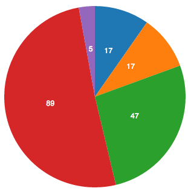
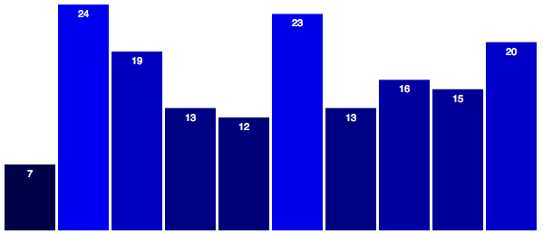
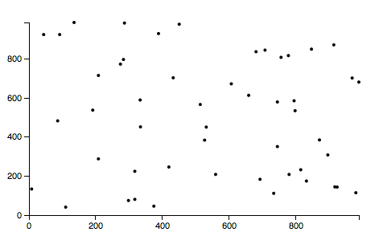
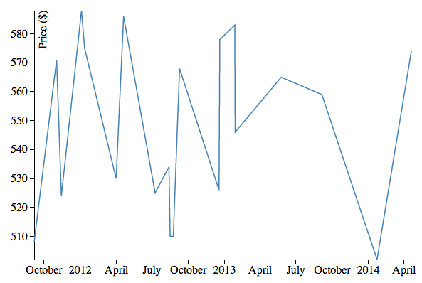

# Reactive D3 Visualizations

[Live Demo](http://reactive-d3.meteor.com/) - [Demo Source](d3-example/)

---------

* [Introduction to D3](#introduction-to-d3)
* [Common Chart Types](#common-chart-types)
* [Base D3 Integration Pattern](#base-d3-intergation-pattern)
* [Binding Events to D3 Controlled Elements](#binding-events-to-d3-controlled-elements)

---------

## Introduction to D3

> D3.js is a JavaScript library for manipulating documents based on data. D3 helps you bring data to life using HTML, SVG and CSS. D3’s emphasis on web standards gives you the full capabilities of modern browsers without tying yourself to a proprietary framework, combining powerful visualization components and a data-driven approach to DOM manipulation.
>
> [D3.js website](http://d3js.org/)

As D3 is a well established library, we won't go very deep into D3 specifics in this article, but rather focus on how to properly utilize D3 in Meteor applications with full reactivity.

The good news is that D3 integrates very well with Meteor applications to create collection driven visualizations.  Only minor changes are needed to adapt most D3 examples to be fully reactive to any data changes.  Since D3 directly manipulates the DOM to create the data visualization, the Meteor rendering engine (Blaze) is not very involved in the actual rendering as D3 handles the creation and manipulation of SVG elements which make up the visualization.  Meteor covers everything but the rendering as it manages the backing data, orchestrates the reactive updates, and binds events to the visualization elements.


#### D3 Resources

The web version of [Interactive Data Visualization for the Web](http://chimera.labs.oreilly.com/books/1230000000345/index.html) is an excellent and in depth resource covering the most common use cases of D3. (Several of the example graphs were adapted from this source)

Since D3 can be used to produce wide array of data visualizations, a good way to start on building your own is to look over the many high quality examples and find one that is close to what you are looking for. A multitude of excellent example graphs can be found in the following galleries: https://github.com/mbostock/d3/wiki/Gallery, http://bl.ocks.org/mbostock

The [D3 API Reference](https://github.com/mbostock/d3/wiki/API-Reference) can be a useful resource when working with D3.


-----------


### Common Chart Types

In the demo application for this article we have provided example code for most basic chart types common in web applications.  Each of these charts is fully reactive to data changes in documents, adding or removing documents, and sorting.

##### Pie Chart - [Source](d3-example/client/pie/)


##### Bar Chart - [Source](d3-example/client/bar/)


##### Scatter Plot - [Source](d3-example/client/scatter/)


##### Line Chart with Time Data - [Source](d3-example/client/line/)



### Base D3 Intergation Pattern

We will use the [bar chart example](d3-example/client/bar/) to talk about the basic pattern used to integrate D3 into a Meteor application.  This same basic pattern was used for all common chart examples and should be extendable to any D3 visualization within a Meteor application.

We start by defining an empty SVG element in template markup

```
<svg id="barChart"></svg>
```

Not much here at all, this is really just a placeholder for D3 to do its work.

All D3 code goes in the rendered callback for the template.  Some code has been omitted using `...` for brevity and to more clearly illustrate the pattern.

```
Template.barChart.rendered = function(){
	//define constants, height/width
	...
	
	//define scales and axises
	...
	
	//define key function to bind elements to documents
	...
	
	//define the SVG element by selecting the SVG via it's id attribute
	var svg = d3.select("#barChart")
		...
		
	//declare a Deps.autorun block
	Deps.autorun(function(){
		
		//perform a reactive query on the collection to get an array
		var dataset = Bars.find(...).fetch();

		//update scale domains and axises
		...

		//select elements that correspond to documents
		var bars = svg.selectAll("rect")
			.data(dataset, key); //bind dataset to objects using key function
		
		//handle new documents via enter()
		bars.enter()
			.append("rect")
			...

		//handle updates to documents via transition()
		bars.transition()
			...

		//handle removed documents via exit()
		bars.exit()
			...
			.remove();
	});
};
```

Following this basic pattern allows for relatively straightforward refactoring of most D3 examples to be driven via Meteor collections.  The key part is separating the D3 code into what gets run once to initiate the visual (before the `Deps.autorun` block) and what gets run on each collection query result change (inside  the `Deps.autorun` block).

It is also possible to use `observe` instead of `Deps.autorun`, see [alternative options](#alternative-options).

#### Driving Updates with Document Changes

We want our visualization to update reactively whenever there is a change in the results of the collection query, contained in the variable `dataset`.

```
var dataset = Bars.find(...).fetch();
```

Since we encased all of the D3 code that updates the visualization within the `Deps.autorun` block, we already have reactivity when the results of the query change in any way.  All we have to do is make sure that the D3 visualization update code handles added, changed, and removed documents.  We use D3 to accomplish this by selecting a group of elements from the SVG and binding them to a data array.

```
var bars = svg.selectAll("rect").data(dataset, key);
```

D3 compares the supplied data to the existing graph and computing the needed changes.  Any elements that are to be newly created are returned by `enter()` while any elements that should be removed are returned by `exit()`.  By using these two D3 functions coupled with an update to any documents that may have been altered, via `transition()`, we have all possible data changes accounted for.

Once we have the reactivity supplied by Meteor and the handling of data changes by D3, we can make simple changes to the collection documents and the graph will automatically update itself.  Since the visualization code is reactively driven by the collection documents, the source of the data change is not relevant.  The changes can be made via event handlers, as shown below, or by any other mechanism.

```
//basic insert/update/remove operations on the collection cause a reactive update to the visualization
Template.barChart.events({
	'click #add':function(){
		Bars.insert({
			value:Math.floor(Math.random() * 25)
		});
	},
	'click #remove':function(){
		var toRemove = Random.choice(Bars.find().fetch());
		Bars.remove({_id:toRemove._id});
	},
	'click #randomize':function(){
		//loop through bars
		Bars.find({}).forEach(function(bar){
			//update the value of the bar
			Bars.update({_id:bar._id},{$set:{value:Math.floor(Math.random() * 25)}});
		});
	}
});
```


For best performance, we avoid running the collection query once to init the graph and then once for each change.  Light refactoring may be required to adapt some D3 examples to have just one reactive query inside the `Deps.autorun` block.


#### Binding Documents to Elements

To ensure that each collection document is correctly bound to it corresponding graph element(s), you'll need to use a `key` function.


```
//in rendered callback
var key = function(d) {
	return d._id;
};
```
This function is used to specify how data is joined to elements.  Since our graph is collection backed, the `_id` property makes sense, but you could use any other property that is unique to the document.


We then use this `key` function as part of our select in the `Deps.autoun` portion of the rendered callback.

```
//in Deps.autorun
var bars = svg.selectAll("rect").data(dataset, key);
		
```

Now D3 will use the `_id` property to link each bar to a single document.  See the [API reference](https://github.com/mbostock/d3/wiki/Selections#data) on this topic for more details.  Without this `key` function, the graph will still work, but certain changes to the collection query results will produce multiple visual effects in the graph.  Removing a document is especially impactful as the index of all preceding elements is adjusted and those elements are redrawn/transitioned.


#### Sorting Documents

Since we are passing the result of a collection query to D3, we have full control over the order of the data that D3 will use to render.  For an example like the bar chart, the collection query can be modified to sort by the `value` property of the document, which is the height of the bar.  We supply a [sort specifier](http://docs.meteor.com/#sortspecifiers) to the collection query to return results in ascending or descending order which will reactively reorder the elements within the visualization.  

```
var dataset = Bars.find({},{sort:{value:1}}).fetch();
```
This is a simplified example for illustrative purposes.  The [bar chart example](d3-example/client/bar/) provides a more complex 3 state (none, asc, desc) sorting toggle using the session to trigger a reactive update of the query results.  You can use a dynamic toggle like this or a sort specifier could be hard coded into the query to always provide consistently ordered results.

### Binding Events to D3 Controlled Elements

We can use native Meteor event maps just like our normal template markup to bind to elements controlled and created by D3.  This allows the visualization to be more tightly integrated with the rest of your application as events on your D3 created elements are just like events on your normal template created elements.

We'll need some context about what was clicked in the event handler, so we start with setting the `data-id` attribute of the rectangle to be the `_id` property of the document when the rectangle enters the graph via an `attr()` method call.

```
//in Deps.autorun block
bars.enter()
	.append("rect")
	... //other attr calls omitted for brevity
	.attr("data-id", function(d){
		return d._id;
	});

```
Then in the template event map, we can pull the `_id` from the event target.

```
Template.barChart.events({
	'click rect':function(event, template){
		alert('you clicked a bar for document with _id=' + $(event.currentTarget).data("id"));
	}
});
```

Now that we know what was clicked, we can act on this event.  This simple example just does an alert, but this pattern could easily be extended to provide a drill down behavior or display a secondary detailed view of a given document.


## Alternative Options

The previously mentioned options are the recommended implementation for all meteor applications.  However, the following options are technically valid and could be useful or desired in certain applications.

> #### Base D3 Integration Pattern Alternatives
> 
> ##### Using `observe` instead of `Deps.autorun`
>
> See the [source of the alternative version of the scatter plot](d3-example/client/scatter-observe/) for a full example
> 
> 
> ```
> var Observe;  //placeholder for observe, needed to stop it on template destruction
>
> ...
>
> Template.scatterPlotObserve.destroyed = function(){
> 	if(Observe)
> 		Observe.stop(); //stop the query when the template is destroyed
> };
> 
> Template.scatterPlotObserve.rendered = function(){
> 	//define constants, height/width
> 	...
> 	
> 	//define scales and axises
> 	...
> 	
> 	//define the SVG element by selecting the SVG via it's id attribute
> 	var svg = d3.select("#scatterPlotObserve")
> 	...
> 	
> 	//declare a transistion function to animate position and scale changes
> 	var transition = function(){		
> 		//find documents needed to scale domains
> 		...
> 		
> 		//update scale domains and axises
> 		...
> 		
> 		//handle transistions to documents via transistion()
> 		...
> 	};
> 
> 	//transistion once right away to set the axis scale
> 	transition();
> 
> 	//decalare a debounced version, only runs once per batch of calls
> 	var lazyTransition = _.debounce(transition, 50);
> 
> 	//declare an observe on a query
> 	Observe = Points.find({},{fields:{x:1,y:1}}).observe({
> 		added: function (document) {
> 			//handle new documents
> 			svg
> 				.append("circle")
> 				.datum(document)//attach data
> 				.attr("id", "point-"+document._id);//set an id
> 				...
> 				
> 			lazyTransition();//transition
> 		},
> 		changed: function (newDocument, oldDocument) {
> 			//handle updates to documents
> 			svg
> 				.select("#point-"+newDocument._id)
> 				.datum(newDocument);//update data
> 			
> 			lazyTransition();//transition
> 		},
> 		removed: function (oldDocument) {
> 			//handle removed documents
> 			svg
> 				.select("#point-"+oldDocument._id)
> 				.remove();//remove element
> 			
> 			lazyTransition();//transition
> 		}
> 	});
> };
> ```
> 
>
> Important differences from the `Deps.autorun` pattern
>
> * No use of D3's `enter()` or `exit()` - Meteor is tracking the changes instead of D3
> * Extra care must be taken to stop the observe and to manage transition calls
> * No attachment of a full dataset to a set of objects, just attach/update data for each object individually
>
> It is possible that this approach is more performant than the preferred and more simplistic `Deps.autorun` pattern.  However it is significantly more complex and example D3 code requires more refactoring, thus the `Deps.autorun` approach is recommended as the preferable option.


----------


### TODO
* could we fork d3 to be a component? let blaze do the rendering?
* line chart example could use real data - like https://coinbase.com/api/doc/1.0/prices/historical.html